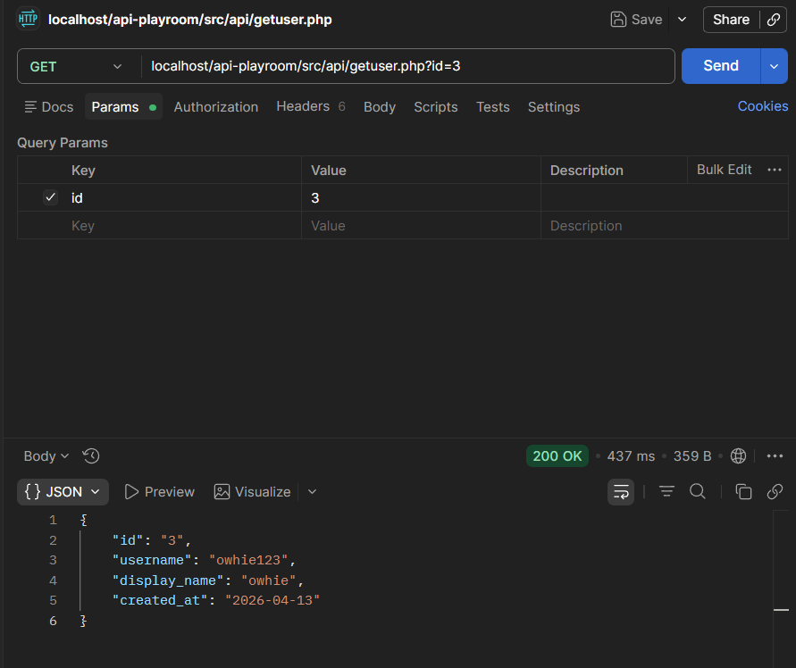

# USERS AND PET TRACKING SYSTEM - SAMPLE REST API

## [📝] Before you start...
1. Clone this repository into your device in `xampp/htdocs/`. Preferably, name it `api-playroom`
2. Import the database version you want into `localhost/phpMyAdmin`
3. Go to `./xampp/php/php.ini` and uncomment `;extension=pdo` and `;extension=pdo_mysql` by removing the semi-colon (;)
4. **[Optional]** Install the [Postman App](https://www.postman.com/downloads/) to test your APIs without making your own client
5. **Test the API** by doing something like this:

6. Do what you must!

## Current Database Schema


## [🌳] Directory Tree
```
api-playroom/
├── .git/
├── doc/                        <-- supporting documentation and dev/member journals
├── README.md
└── src/                        <-- source code
    ├── api/                    <-- api files
    │   ├── getuser.php
    │   └── getusers.php
    ├── client/                 <-- client files
    ├── core/                   <-- supporting core structure 
    │   ├── initialize.php
    │   ├── pets.php            // add functions for PET class here
    │   └── users.php           // add functions for USERS class here
    ├── database/               <-- database backup; please explain changes in commit message
    │   ├── user_system.2.sql
    │   └── user_system.sql
    └── include/                // reusable php code                 
        └── db.php
```