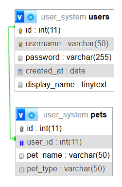

# API Playroom

Sample REST API for users and pets using PHP + MariaDB/MySQL.

## Before You Start

1. Clone this repository (if using XAMPP, place it in `xampp/htdocs/` and keep folder name `api-playroom`).
2. Import `src/database/user_system.2.sql` into your local DB server.
3. If using XAMPP, ensure `pdo` and `pdo_mysql` are enabled in `xampp/php/php.ini`.
4. Choose your runtime mode: Docker, XAMPP, or Hybrid (documented below).
5. Verify API health after startup:
   - XAMPP: `http://localhost/api-playroom/src/api/healthcheck.php`
   - Docker: `http://localhost:8080/api/healthcheck.php`

## Current Database Schema



## Version Alignment (Docker <-> XAMPP)

Docker is pinned to match your XAMPP stack more closely:
- PHP image: `php:8.2.12-apache-bookworm`
- DB image: `mariadb:10.4.32`

Note: `.env` keeps `MYSQL_*` variable names for compatibility, and they are mapped to MariaDB container vars in `docker-compose.yml`.
Note: Docker now uses volume `db_data_mariadb` for DB files, so previous MySQL 8 data is kept untouched in the old volume.

## Run With Docker

1. From `api-playroom`, start services:
   ```bash
   docker compose up --build
   ```
2. Open the local interface:
   - App: http://localhost:8080
   - phpMyAdmin: http://localhost:8081

The DB is initialized automatically from `src/database/user_system.2.sql`.

## Run With XAMPP

1. Start `Apache` and `MySQL` from XAMPP Control Panel.
2. Copy or clone this project into your XAMPP `htdocs` folder.
3. Import `src/database/user_system.2.sql` in phpMyAdmin (XAMPP), creating DB `user_system`.
4. Open:
   - App: `http://localhost/api-playroom/src`
   - phpMyAdmin: `http://localhost/phpmyadmin`

`src/include/db.php` already falls back to local defaults when env vars are not set:
- Host: `127.0.0.1`
- User: `root`
- Password: empty
- DB: `user_system`

## Hybrid Mode (XAMPP Apache + Docker MySQL)

If you prefer Apache from XAMPP but DB from Docker:

1. Start only the DB service:
   ```bash
   docker compose up -d db
   ```
2. Run PHP from XAMPP (`http://localhost/api-playroom/src`).
3. Set DB env values for Apache/PHP (or update `src/include/db.php`) to:
   - `DB_HOST=127.0.0.1`
   - `DB_NAME=user_system`
   - `DB_USER=api_user`
   - `DB_PASS=api_password`

## API Endpoints

- `GET api/getusers.php`
- `GET api/getuser.php?id=<id>`
- `GET api/healthcheck.php`

Dual healthcheck URLs:
- XAMPP: `http://localhost/api-playroom/src/api/healthcheck.php`
- Docker: `http://localhost:8080/api/healthcheck.php`

## Stop Services

```bash
docker compose down
```

To also remove DB data volume:

```bash
docker compose down -v
```

## Project Structure

```text
api-playroom/
|-- doc/
|-- src/
|   |-- api/
|   |-- core/
|   |-- database/
|   |-- include/
|   `-- index.html
|-- Dockerfile
|-- docker-compose.yml
|-- docker-compose.override.yml
|-- .env
`-- README.md
```
